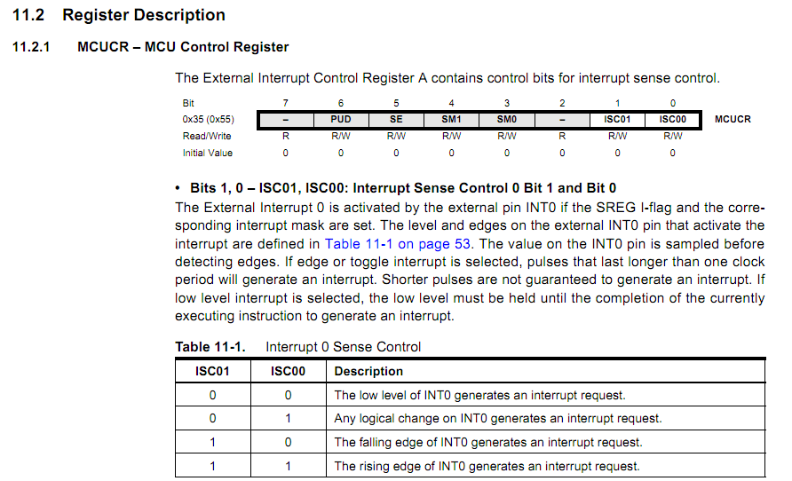
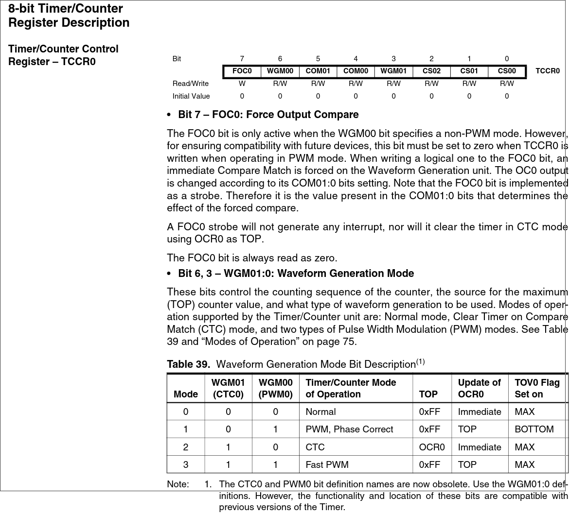

<style scoped>
h1, h2{
  font-size: 50px
}
p {
    font-size: 25px
}
</style>

<style>
  :root {
    --color-background: #ddd;
    --color-background-code: #ccc;
    --color-background-paginate: rgba(128, 128, 128, 0.05);
    --color-foreground: #345;
    --color-highlight: #99c;
    --color-highlight-hover: #aaf;
    --color-highlight-heading: #99c;
    --color-header: #bbb;
    --color-header-shadow: transparent;
  }
</style>

## *Петербургский государственный университет путей сообщения Императора Александра I*

# МИУС

Ведет: *аспирант 2 года* **Волков Егор Алексеевич**
***gole00201@gmail.com***
ауд. 11 - 304

<br>
Санкт-Петербург 2024

---

# Введение в прерывания

---

**Прерывания** — это механизм, позволяющий микроконтроллеру временно приостанавливать выполнение основной программы для выполнения определённых задач, которые требуют немедленного внимания. Прерывания дают возможность реагировать на события (например, сигналы на входах, переполнение таймера) в реальном времени.

---
Как только срабатывает **определённое условие** (например, сигнал на входе или переполнение таймера), микроконтроллер останавливает основное выполнение кода и начинает выполнять специальную подпрограмму — обработчик прерывания **(Interrupt Service Routine, ISR)**.

---


# Процесс срабатывания прерывания

**Событие может происходить по-разному в зависимости от типа прерывания.**
    - Внешние прерывания (INT0, INT1) срабатывают при изменении уровня сигнала на определённом выводе;
    - Таймеры могут вызвать прерывание;
    - Прерывание АЦП срабатывает при завершении аналого-цифрового преобразования.

---

**Запись в регистр флага прерывания:**
При возникновении события, соответствующий флаг прерывания (например, TOV0 для переполнения таймера) устанавливается в 1. Этот флаг указывает микроконтроллеру, что возникло прерывание, требующее обработки.

---

**Проверка глобального разрешения прерываний:**
Если глобальные прерывания разрешены (бит I в регистре статуса SREG установлен), микроконтроллер сможет реагировать на событие. Глобальные прерывания активируются командой sei().

---

**Переход к обработчику прерывания:**
Микроконтроллер приостанавливает выполнение текущей программы и переходит к нужному обработчику прерывания (ISR), который расположен по адресу, указанному в таблице векторов прерываний. После завершения работы обработчика программа возвращается к исполнению с того места, где она была приостановлена.

---

# Настройка прерываний
Прежде чем использовать прерывания, важно понять, как настроить их в AVR-GCC. Основные шаги настройки прерываний на ATmega8535:

- Включить глобальные прерывания.
- Активировать конкретные прерывания (например, таймера или внешнего прерывания).
- Установить соответствующие параметры прерывания.
---
# Включение глобальных прерываний

Для включения глобальных прерываний в AVR-GCC используется макрос `sei()` из библиотеки <avr/interrupt.h>. Команда sei() активирует глобальный флаг прерываний, что позволяет микроконтроллеру реагировать на прерывания.

---

```c

#include <avr/interrupt.h>

int main() {
    sei(); // Включаем глобальные прерывания
    while (1) {
        // Основной код программы
    }
    return 0;
}
```
---
Для отключения глобальных прерываний можно использовать команду `cli()`, что может быть полезно для временного подавления всех прерываний.

---

# Прерывания внешних входов


ATmega8535 имеет два внешних входа прерываний — INT0 и INT1. Эти прерывания могут быть настроены на срабатывание при различных условиях сигнала на входе.

---

**Конфигурация прерывания INT0**
- Настроим регистр GICR (General Interrupt Control Register), чтобы разрешить прерывание на входе INT0.
- Укажем, при каком сигнале на входе INT0 должно срабатывать прерывание, установив нужные значения в регистр MCUCR (MCU Control Register).

---



---
Регистр **GICR** управляет маскированием внешних прерываний и размещением таблицы векторов прерываний.

Формат регистра **GICR**:

    бит 7 — INT1, маска внешнего прерывания INT1;

    бит 6 — INT0, маска внешнего прерывания INT0;

    бит 5 — INT2, маска внешнего прерывания INT2;

    бит 1 — IVSEL (Interrupt Vector Select);

    бит 0 — IVCE (Interrupt Vector Change Enable).
---

Пример кода:

```c

#include <avr/io.h>
#include <avr/interrupt.h>

ISR(INT0_vect) {
    // Код, выполняемый при срабатывании прерывания на INT0
    PORTB ^= (1 << PB0); // Переключаем состояние вывода PB0
}

int main() {
    DDRB |= (1 << PB0); // Настраиваем PB0 как выход
    GICR |= (1 << INT0); // Включаем прерывание INT0
    MCUCR |= (1 << ISC01); // Устанавливаем срабатывание по спадающему фронту
    sei(); // Включаем глобальные прерывания
    while (1) {
        // Основной код программы
    }
    return 0;
}
```
---

В этом примере мы настроили прерывание INT0 на срабатывание при спадающем фронте. При срабатывании прерывания программа переключает состояние вывода PB0.

---

# Основы работы таймеров

Таймеры в микроконтроллерах — это счётчики, которые могут отсчитывать определённое количество тактов и срабатывать на заданные события, такие как переполнение или достижение определённого значения. ATmega8535 включает три таймера: Timer0 и Timer2 (по 8 бит), а также Timer1 (16-битный таймер). Встроенные прерывания позволяют микроконтроллеру реагировать на события таймеров (например, переполнение или совпадение).

---
# Режимы работы таймеров

- Normal Mode (обычный режим): Счётчик увеличивается до максимума, затем сбрасывается и генерирует прерывание по переполнению.
- Clear Timer on Compare Match (CTC): Таймер сбрасывается при совпадении с заданным значением в регистре OCR (Output Compare Register) и генерирует прерывание.

---

- Fast PWM (ШИМ режим): Создаёт ШИМ-сигналы с быстрым переключением значений.
- Phase Correct PWM (фазокорректированный ШИМ): Таймер отсчитывает от минимума к максимуму и обратно, создавая ШИМ с меньшими помехами.

---

Каждый режим используется для разных целей. Например, Normal Mode удобен для подсчёта тактов, CTC — для создания периодических событий, а PWM режимы — для генерации ШИМ-сигналов.

---

# Таймеры в ATmega8535

Таймеры могут использовать внутренние и внешние **источники тактов**, что регулируется через **предделители** — множители, которые задают, сколько тактов нужно пропустить перед инкрементом счётчика. ATmega8535 поддерживает предделители, такие как **8, 64, 256 и 1024**.

---
# Регистр управления таймерами (TCCR)

Регистр **TCCR (Timer/Counter Control Register)** используется для настройки режимов работы таймера и выбора предделителей.

Пример для **Timer0**:

    TCCR0 управляет режимами и предделителями Timer0.
    Основные биты:
        WGM01 и WGM00: задают режим работы (Normal, CTC, PWM).
        CS02, CS01, и CS00: выбирают предделитель.

---



---

# Прерывания для таймеров в ATmega8535:

- Переполнение таймера (Overflow): Таймер увеличивается до своего максимального значения и сбрасывается на 0, вызывая прерывание.
- Сравнение (Compare Match): Таймер сравнивается с заданным значением в OCR (Output Compare Register) и, если они совпадают, вызывается прерывание. Пример CTC-режима.

---

# Пример использования Timer0 с прерыванием по переполнению

Задача: создать прерывание, которое будет срабатывать каждую 0,5 секунды, чтобы переключать светодиод.

---

**Настроим таймер:**
- Timer0, Normal Mode, предделитель 1024.
- Используем прерывание **по переполнению**: прерывание будет вызываться каждый раз, когда таймер переполняется (**достигает 255** и сбрасывается).

---
```c
#include <avr/io.h>
#include <avr/interrupt.h>

ISR(TIMER0_OVF_vect) {
    // Код, который выполняется при каждом переполнении Timer0
    PORTB ^= (1 << PB0); // Переключаем состояние светодиода на PB0
}

int main() {
    DDRB |= (1 << PB0); // Настраиваем PB0 как выход для светодиода
    // Настраиваем таймер
    TCCR0 = (1 << CS02) | (1 << CS00); // Предделитель 1024, Normal Mode
    TIMSK = (1 << TOIE0); // Включаем прерывание по переполнению Timer0

    sei(); // Включаем глобальные прерывания

    while (1) {
        // Основной код программы (прерывание выполняет мигалки светодиодом)
    }
    return 0;
}
```

---

# Расчёт времени прерывания по переполнению

Для точного расчёта времени срабатывания прерывания нужно учесть частоту работы микроконтроллера (например, 10 МГц), предделитель и количество тактов для достижения переполнения.

---

**Формула:**

$$
t_{переполнения} = \frac{C_{пределитель}256}{f_{cpu}}
$$

---

$$
t_{переполнения} = \frac{1024 \cdot 256}{10 \cdot 10^{6}} \approx 0.02 \text{ с}
$$

---

Для достижения 0.5 секунд потребуется 0.5 / 0.02 ≈ 25 переполнений.

В ISR можно использовать счётчик, чтобы отслеживать количество переполнений.

---

```c

ISR(TIMER0_OVF_vect) {
    static uint8_t count = 0;
    count++;
    if (count >= 25) {
        PORTB ^= (1 << PB0); // Переключаем светодиод
        count = 0;
    }
}

int main() {
    DDRB |= (1 << PB0); // Настраиваем PB0 как выход для светодиода
    // Настраиваем таймер
    TCCR0 = (1 << CS02) | (1 << CS00); // Предделитель 1024, Normal Mode
    TIMSK = (1 << TOIE0); // Включаем прерывание по переполнению Timer0

    sei(); // Включаем глобальные прерывания

    while (1) {
        // Основной код программы (прерывание выполняет мигалки светодиодом)
    }
    return 0;
}
```